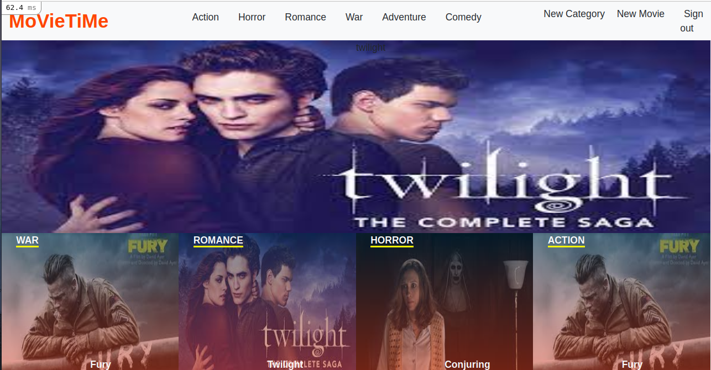
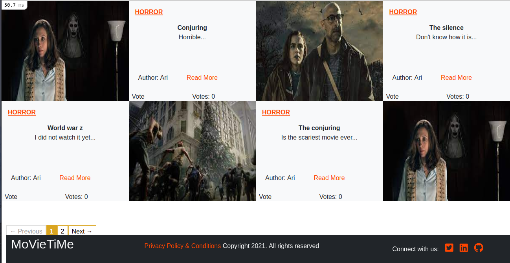

<br />
<p align="center">
    
  <h3 align="center">RoR / Capstone --> [Movietime]</h3>

  <p align="center">
    This project is the Capstone of the Microverse curriculum at the end of the Ruby on Rails module!
  </p>
</p>

Movie time project, Users can create categories and movies of their choice, where they create movies and give title, description and a photo about it and other users can vote for the movies they like.

## Technologies used

- Ruby
- Rails
- Bootstrap
- Will_paginate
- Rubocop
- Webpacker
- postgresql
- Git

## 🚀 the project

This project can be found in (https://github.com/arikarim/rails-capstone/tree/main)


### ✨ [live version](https://moveitime.herokuapp.com/)

## Home Page

###   


## Show page

###   


## Register page

###   


## Log in page

###   

## New Movie page

###   

## New Category page

###   


## 🔨 instructions

To get started with the app, clone the repo and then install the needed gems:

```
$ bundle install --without production
```

Next, migrate the database:

```
$ rails db:migrate
```

Next, seed the database:

```
$ rails db:seed
```


## Upload Images and create Articles

in order to be able to create movies(articles) in local machine you should do the following:

- create an account on cloudinary

- on your cloudinary dashboard you can see your(CLOUD_NAME, CLOUD_API AND CLOUD SECRET).

- inside the config file create cloudinary.yml file and paste thid code below:

---
development: <br/>
  cloud_name: put yours<br/>
  api_key: 'put yours'<br/>
  api_secret: put yours<br/>
  enhance_image_tag: true<br/>
  static_file_support: false<br/>
production:<br/>
  cloud_name: put yours<br/>
  api_key: 'put yours'<br/>
  api_secret: put yours<br/>
  enhance_image_tag: true<br/>
  static_file_support: true<br/>
test:<br/>
  cloud_name: put yours<br/>
  api_key: 'put yours'<br/>
  api_secret: put yours<br/>
  enhance_image_tag: true<br/>
  static_file_support: false<br/>

- change cloud_name, api_key and api_secret to yours using the cloudinary dashboard.


## Rspec and Capibara

- bundle exec rspec

when the tests passed you can ru the server with:

```
$ rails server
```


## 🤝 contributing

contributions, issues, and feature requests are welcome!<br/>feel free to check [issues page](https://github.com/arikarim/rails-capstone/issues).

1. fork it (https://github.com/arikarim/rails-capstone/fork)
2. create your working branch (git checkout -b [choose-a-name])
3. commit your changes (git commit -am 'what this commit will fix/add/improve')
4. push to the branch (git push origin [chosen-name])
5. create a new pull request

## Author

- GitHub: [@arikarim](https://github.com/arikarim)
- LinkedIn: [AriKarim](https://www.linkedin.com/in/ari-karim-523bb81b3)

## 🙋‍♂ show your support

give a ⭐️ if you like this project!

## 📝 license

This project is [MIT](LICENSE) licensed.
